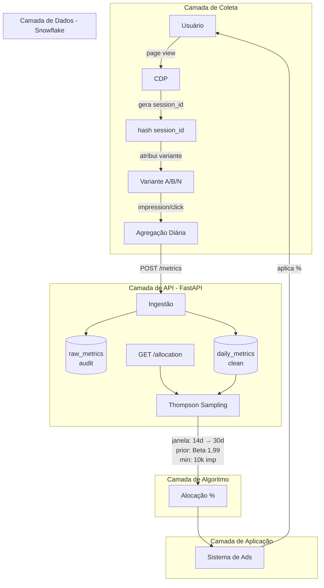
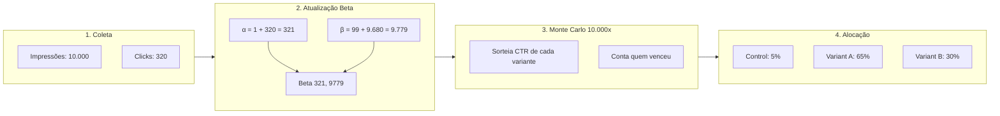

# Multi-Armed Bandit Optimization API

API para otimização de tráfego em testes A/B usando algoritmo Multi-Armed Bandit (Thompson Sampling).

## Índice

- [Visão Geral](#visão-geral)
- [Arquitetura](#arquitetura)
- [Algoritmo](#algoritmo)
- [Instalação](#instalação)
- [Configuração](#configuração)
- [Uso](#uso)
- [API Endpoints](#api-endpoints)
- [Rate Limiting](#rate-limiting)
- [Logging Estruturado](#logging-estruturado)
- [Testes](#testes)

## Visão Geral

Esta API recebe dados de experimentos A/B (impressões e clicks por variante), processa usando SQL, e retorna a alocação de tráfego otimizada para o dia seguinte.

### Características

- **Algoritmo**: Thompson Sampling com modelo Beta-Bernoulli
- **Banco de dados**: Snowflake
- **Multi-variante**: Suporta N variantes (não apenas A/B)
- **Tratamento de não-estacionariedade** via janela temporal
- **Rate Limiting**: Proteção contra abuso
- **Logging Estruturado**: JSON para observabilidade
- **Documentação**: Swagger UI automático

## Arquitetura


### Fluxo de Dados

1. **Ingestão**: Job diário envia dados agregados de GAM/CDP para a API
2. **Armazenamento**: Dados são salvos em `raw_metrics` (auditoria) e `daily_metrics` (limpo)
3. **Cálculo**: Thompson Sampling processa últimos 14 dias e retorna alocação

### Atribuição de Variantes

A API **não** atribui variantes. Ela apenas retorna a % de alocação.

O CDP usa essa % para distribuir o tráfego por sessão.

## Algoritmo


### Formulação

Cada variante é modelada como uma variável Bernoulli (clique / não clique), com incerteza representada por uma distribuição **Beta**.

Para cada variante `i`:

```
CTR_i ~ Beta(α_i, β_i)
```

Onde:

```
α_i = α₀ + clicks_i
β_i = β₀ + impressions_i - clicks_i
```

### Prior (Fallback)

Como o teste não fornece histórico agregado suficiente, é utilizado um **prior fraco e explicitamente assumido**:

```
α₀ = 1
β₀ = 99
```

- CTR esperada ≈ 1%
- Representa conhecimento prévio mínimo
- Evita comportamento extremo no cold start

### Decisão

Em cada rodada:

1. Amostramos valores de CTR de cada distribuição Beta
2. Selecionamos a variante com maior valor amostrado
3. Repetimos o processo múltiplas vezes
4. A alocação final é a proporção de vezes que cada variante foi selecionada

---

## Janela Temporal e Fallback

O ambiente é tratado como **não estacionário**. Para evitar aprender com dados obsoletos, o algoritmo utiliza janelas temporais.

### Regras

- **Janela padrão**: últimos 14 dias
- **Volume mínimo**: 10.000 impressões por variante
- **Idade máxima absoluta**: 30 dias

### Lógica

```
1. Coletar métricas dos últimos 14 dias
2. Se todas as variantes tiverem >= 10.000 impressões:
       usar esses dados
3. Caso contrário:
       expandir janela até 30 dias
4. Se ainda assim não atingir 10.000 impressões:
       usar apenas o prior (fallback)
```

Isso garante estabilidade estatística sem comprometer adaptação a mudanças recentes.

### Por que 10.000 impressões?

Para publishers com receita média de R$ 30k/mês (~50.000+ impressões/dia), o threshold de 10.000 impressões é atingido em poucas horas. Isso garante:
- Intervalos de confiança estreitos antes de otimizar
- Evita decisões baseadas em ruído de curto prazo
- Cold start de ~1 dia para novos experimentos

---

## Instalação

### Requisitos

- Python >=3.11
- Snowflake account

### Setup Local

```bash
# Clonar repositório
git clone <repo>
cd mab-api

# Criar ambiente virtual
python -m venv .venv
source .venv/bin/activate  # Linux/Mac
# .venv\Scripts\activate   # Windows

# Instalar dependências
pip install -e ".[dev]"

# Copiar configuração
cp env.example .env
# Editar .env com suas credenciais Snowflake
```

### Setup Snowflake

```bash
# Executar scripts SQL
snowsql -f infrastructure/snowflake/01_create_database.sql
snowsql -f infrastructure/snowflake/02_create_tables.sql
```

## Configuração

### Variáveis de Ambiente

```env
# Snowflake
SNOWFLAKE_ACCOUNT=xxx.us-east-1
SNOWFLAKE_USER=mab_user
SNOWFLAKE_PASSWORD=xxx
SNOWFLAKE_WAREHOUSE=compute_wh
SNOWFLAKE_DATABASE=activeview_mab
SNOWFLAKE_SCHEMA=experiments

# API
API_HOST=0.0.0.0
API_PORT=8000

# Algoritmo
DEFAULT_WINDOW_DAYS=14
MAX_WINDOW_DAYS=30
MIN_IMPRESSIONS=10000
THOMPSON_SAMPLES=10000

# Prior (Beta distribution)
PRIOR_ALPHA=1
PRIOR_BETA=99

# Logging
LOG_LEVEL=INFO  # DEBUG, INFO, WARNING, ERROR, CRITICAL

# Rate Limiting
RATE_LIMIT_ENABLED=true
RATE_LIMIT_DEFAULT_MAX=100
RATE_LIMIT_DEFAULT_WINDOW=60
```

## Uso

### Iniciar API

```bash
uvicorn src.main:app --reload
```

A API estará disponível em `http://localhost:8000`.

### Documentação Interativa

- Swagger UI: `http://localhost:8000/docs`
- ReDoc: `http://localhost:8000/redoc`

## API Endpoints

### 1. Criar Experimento

```bash
curl -X POST http://localhost:8000/experiments \
  -H "Content-Type: application/json" \
  -d '{
    "name": "homepage_cta_test",
    "description": "Testing CTA button variants",
    "variants": [
      {"name": "control", "is_control": true},
      {"name": "variant_a", "is_control": false},
      {"name": "variant_b", "is_control": false}
    ]
  }'
```

### 2. Registrar Métricas

```bash
curl -X POST http://localhost:8000/experiments/{experiment_id}/metrics \
  -H "Content-Type: application/json" \
  -d '{
    "date": "2025-01-15",
    "metrics": [
      {"variant_name": "control", "impressions": 10000, "clicks": 320},
      {"variant_name": "variant_a", "impressions": 10000, "clicks": 420},
      {"variant_name": "variant_b", "impressions": 10000, "clicks": 380}
    ]
  }'
```

### 3. Obter Alocação

```bash
curl http://localhost:8000/experiments/{experiment_id}/allocation
```

**Resposta:**

```json
{
  "experiment_id": "exp_abc123",
  "experiment_name": "homepage_cta_test",
  "computed_at": "2025-01-16T00:00:00Z",
  "algorithm": "thompson_sampling",
  "window_days": 14,
  "allocations": [
    {
      "variant_name": "control",
      "is_control": true,
      "allocation_percentage": 5.2,
      "metrics": {"impressions": 140000, "clicks": 4480, "ctr": 0.032}
    },
    {
      "variant_name": "variant_a",
      "is_control": false,
      "allocation_percentage": 65.3,
      "metrics": {"impressions": 140000, "clicks": 5880, "ctr": 0.042}
    },
    {
      "variant_name": "variant_b",
      "is_control": false,
      "allocation_percentage": 29.5,
      "metrics": {"impressions": 140000, "clicks": 5320, "ctr": 0.038}
    }
  ]
}
```

**Resposta com Fallback:**

Quando não há dados suficientes:
```json
{
  "algorithm": "thompson_sampling (fallback: prior only)",
  "window_days": 30,
  ...
}
```

### 4. Atualizar Status do Experimento

```bash
curl -X PATCH http://localhost:8000/experiments/{experiment_id}/status \
  -H "Content-Type: application/json" \
  -d '{"status": "paused"}'
```

Status válidos: `active`, `paused`, `completed`

### 5. Histórico de Métricas

```bash
curl http://localhost:8000/experiments/{experiment_id}/history
```

## Rate Limiting

A API possui rate limiting para proteger contra abuso e garantir disponibilidade.

### Limites por Endpoint

| Endpoint | Limite | Uso |
|----------|--------|-----|
| POST /experiments | 10/min | Criação de experimentos |
| POST /metrics | 100/min | Ingestão de métricas |
| GET /allocation | 300/min, 3000/dia | Consulta de alocação |
| GET /history | 60/min | Consulta de histórico |
| GET /experiments/{id} | 120/min | Consulta de experimento |
| Default | 100/min | Outros endpoints |

### Limite Diário de Alocação

O endpoint `GET /allocation` possui um limite adicional de **3000 chamadas por dia** (reseta à meia-noite UTC). Isso existe porque cada chamada acorda o warehouse do Snowflake e executa simulação Monte Carlo, gerando custo.

Para uso típico (1 experimento, 1 chamada/dia), esse limite é mais que suficiente.

### Headers de Resposta

Toda resposta inclui headers de rate limit:

```
X-RateLimit-Limit: 300
X-RateLimit-Remaining: 299
X-RateLimit-Reset: 60
```

### Resposta 429 (Rate Limit Exceeded)

```json
{
  "detail": {
    "error": "Rate limit exceeded",
    "limit": 300,
    "window_seconds": 60,
    "retry_after": 45
  }
}
```

## Logging Estruturado

A API usa logging estruturado em formato JSON para observabilidade.

### Formato dos Logs

```json
{
  "timestamp": "2025-01-15T10:30:00.123Z",
  "level": "INFO",
  "logger": "mab_api",
  "message": "GET /experiments/abc/allocation 200",
  "type": "http_request",
  "method": "GET",
  "path": "/experiments/abc/allocation",
  "status_code": 200,
  "duration_ms": 145.32,
  "client_ip": "192.168.1.1"
}
```

### Tipos de Log

| Type | Descrição |
|------|-----------|
| `http_request` | Requisições HTTP |
| `db_query` | Queries ao Snowflake |
| `algorithm` | Execução do Thompson Sampling |
| `error` | Erros e exceções |
| `startup` | Inicialização da API |
| `shutdown` | Encerramento da API |

### Integração com Observabilidade

Os logs em JSON são compatíveis com:
- **Datadog**: Log pipeline automático
- **CloudWatch**: Logs Insights queries
- **ELK Stack**: Elasticsearch indexing
- **Splunk**: JSON source type

## Testes

```bash
# Rodar todos os testes
pytest -v

# Apenas unit tests
pytest tests/unit -v

# Apenas integration tests
pytest tests/integration -v

# Com cobertura
pytest --cov=src
```

## Estrutura do Projeto

```
mab-api/
├── src/
│   ├── main.py              # FastAPI app
│   ├── config.py            # Settings
│   ├── logging_config.py    # Structured logging
│   ├── rate_limit.py        # Rate limiting middleware
│   ├── middleware.py        # Request logging middleware
│   ├── models/              # Pydantic schemas
│   ├── repositories/        # Data access
│   ├── services/            # Business logic
│   ├── routers/             # API endpoints
│   └── sql/                 # SQL queries
├── infrastructure/
│   └── snowflake/           # DDL scripts
├── tests/
│   ├── unit/
│   │   ├── test_allocation.py
│   │   ├── test_rate_limit.py
│   │   ├── test_logging.py
│   │   └── test_middleware.py
│   └── integration/
│       └── test_api.py
├── dashboard/
│   └── streamlit_dashboard.py
├── docs/
│   ├── DATA_DICTIONARY.md
│   ├── ERD.md
│   └── API.md
├── env.example
├── README.md
└── pyproject.toml
```
