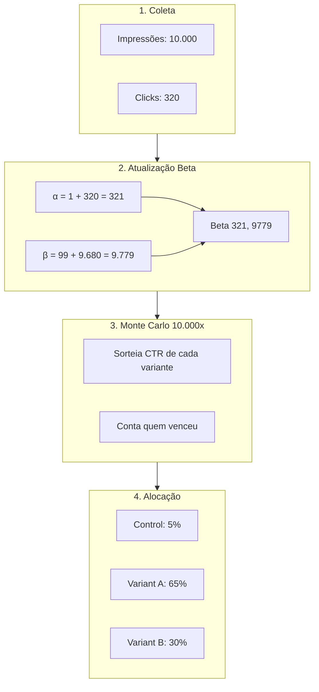
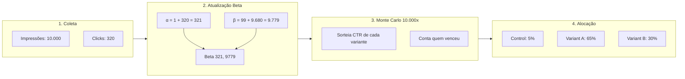

# Multi-Armed Bandit Optimization API

API para otimização de tráfego em testes A/B usando algoritmo Multi-Armed Bandit (Thompson Sampling).

## Índice

- [Visão Geral](#visão-geral)
- [Arquitetura](#arquitetura)
- [Algoritmo](#algoritmo)
- [Instalação](#instalação)
- [Configuração](#configuração)
- [Uso](#uso)
- [API Endpoints](#api-endpoints)
- [Testes](#testes)

## Visão Geral

Esta API recebe dados de experimentos A/B (impressões e clicks por variante), processa usando SQL, e retorna a alocação de tráfego otimizada para o dia seguinte.

### Características

- **Algoritmo**: Thompson Sampling com modelo Beta-Bernoulli
- **Banco de dados**: Snowflake
- **Multi-variante**: Suporta N variantes (não apenas A/B)
- **Tratamento de não-estacionariedade** via janela temporal
- **Documentação**: Swagger UI automático

## Arquitetura


### Fluxo de Dados

1. **Ingestão**: Job diário envia dados agregados de GAM/CDP para a API
2. **Armazenamento**: Dados são salvos em `raw_metrics` (auditoria) e `daily_metrics` (limpo)
3. **Cálculo**: Thompson Sampling processa últimos 14 dias e retorna alocação

### Atribuição de Variantes

A atribuição de variante deve ser feita **por sessão** na camada de coleta (CDP):

```
Usuário acessa página → CDP gera session_id → Hash(session_id) % 100 → Define variante
```

Isso garante consistência durante a navegação sem depender de login.

## Algoritmo


### Formulação

Cada variante é modelada como uma variável Bernoulli (clique / não clique), com incerteza representada por uma distribuição **Beta**.

Para cada variante `i`:

```
CTR_i ~ Beta(α_i, β_i)
```

Onde:

```
α_i = α₀ + clicks_i
β_i = β₀ + impressions_i - clicks_i
```

### Prior (Fallback)

Como o teste não fornece histórico agregado suficiente, é utilizado um **prior fraco e explicitamente assumido**:

```
α₀ = 1
β₀ = 99
```

- CTR esperada ≈ 1%
- Representa conhecimento prévio mínimo
- Evita comportamento extremo no cold start

### Decisão

Em cada rodada:

1. Amostramos valores de CTR de cada distribuição Beta
2. Selecionamos a variante com maior valor amostrado
3. Repetimos o processo múltiplas vezes
4. A alocação final é a proporção de vezes que cada variante foi selecionada

---

## Janela Temporal e Fallback

O ambiente é tratado como **não estacionário**. Para evitar aprender com dados obsoletos, o algoritmo utiliza janelas temporais.

### Regras

- **Janela padrão**: últimos 14 dias
- **Volume mínimo**: 200 impressões por variante
- **Idade máxima absoluta**: 30 dias

### Lógica

```
1. Coletar métricas dos últimos 14 dias
2. Se uma variante tiver >= 200 impressões:
       usar esses dados
3. Caso contrário:
       expandir janela até 30 dias
4. Se ainda assim não atingir 200 impressões:
       usar apenas o prior (fallback)
```

Isso garante estabilidade estatística sem comprometer adaptação a mudanças recentes.

---

## Instalação

### Requisitos

- Python 3.11+
- Snowflake account

### Setup Local

```bash
# Clonar repositório
git clone <repo>
cd mab-api

# Criar ambiente virtual
python -m venv .venv
source .venv/bin/activate  # Linux/Mac
# .venv\Scripts\activate   # Windows

# Instalar dependências
pip install -e ".[dev]"

# Copiar configuração
cp .env.example .env
# Editar .env com suas credenciais Snowflake
```

### Setup Snowflake

```bash
# Executar scripts SQL
snowsql -f infrastructure/snowflake/01_create_schema.sql
snowsql -f infrastructure/snowflake/02_create_tables.sql
```

## Configuração

### Variáveis de Ambiente

```env
# Snowflake
SNOWFLAKE_ACCOUNT=xxx.us-east-1
SNOWFLAKE_USER=mab_user
SNOWFLAKE_PASSWORD=xxx
SNOWFLAKE_WAREHOUSE=compute_wh
SNOWFLAKE_DATABASE=activeview_mab
SNOWFLAKE_SCHEMA=experiments

# API
API_HOST=0.0.0.0
API_PORT=8000

# Algoritmo
DEFAULT_WINDOW_DAYS=14
MAX_WINDOW_DAYS=30
MIN_IMPRESSIONS=200
THOMPSON_SAMPLES=10000

# Prior (Beta distribution)
PRIOR_ALPHA=1
PRIOR_BETA=99
```

## Uso

### Iniciar API

```bash
uvicorn src.main:app --reload
```

A API estará disponível em `http://localhost:8000`.

### Documentação Interativa

- Swagger UI: `http://localhost:8000/docs`
- ReDoc: `http://localhost:8000/redoc`

## API Endpoints

### 1. Criar Experimento

```bash
curl -X POST http://localhost:8000/experiments \
  -H "Content-Type: application/json" \
  -d '{
    "name": "homepage_cta_test",
    "description": "Testing CTA button variants",
    "variants": [
      {"name": "control", "is_control": true},
      {"name": "variant_a", "is_control": false},
      {"name": "variant_b", "is_control": false}
    ]
  }'
```

### 2. Registrar Métricas

```bash
curl -X POST http://localhost:8000/experiments/{experiment_id}/metrics \
  -H "Content-Type: application/json" \
  -d '{
    "date": "2025-01-15",
    "metrics": [
      {"variant_name": "control", "impressions": 10000, "clicks": 320},
      {"variant_name": "variant_a", "impressions": 10000, "clicks": 420},
      {"variant_name": "variant_b", "impressions": 10000, "clicks": 380}
    ]
  }'
```

### 3. Obter Alocação

```bash
curl http://localhost:8000/experiments/{experiment_id}/allocation
```

**Resposta:**

```json
{
  "experiment_id": "exp_abc123",
  "experiment_name": "homepage_cta_test",
  "computed_at": "2025-01-16T00:00:00Z",
  "algorithm": "thompson_sampling",
  "window_days": 14,
  "allocations": [
    {
      "variant_name": "control",
      "is_control": true,
      "allocation_percentage": 5.2,
      "metrics": {"impressions": 140000, "clicks": 4480, "ctr": 0.032}
    },
    {
      "variant_name": "variant_a",
      "is_control": false,
      "allocation_percentage": 65.3,
      "metrics": {"impressions": 140000, "clicks": 5880, "ctr": 0.042}
    },
    {
      "variant_name": "variant_b",
      "is_control": false,
      "allocation_percentage": 29.5,
      "metrics": {"impressions": 140000, "clicks": 5320, "ctr": 0.038}
    }
  ]
}
```

### 4. Histórico de Métricas

```bash
curl http://localhost:8000/experiments/{experiment_id}/history
```

## Testes

```bash
# Rodar todos os testes
pytest -v

# Apenas unit tests
pytest tests/unit -v

# Apenas integration tests
pytest tests/integration -v

# Com cobertura
pytest --cov=src
```

## Estrutura do Projeto

```
mab-api/
├── src/
│   ├── main.py              # FastAPI app
│   ├── config.py            # Settings
│   ├── models/              # Pydantic schemas
│   ├── repositories/        # Data access
│   ├── services/            # Business logic
│   ├── routers/             # API endpoints
│   └── sql/                 # SQL queries
├── infrastructure/
│   └── snowflake/           # DDL scripts
├── tests/
│   ├── unit/
│   └── integration/
├── dashboard/
│   └── streamlit_dashboard.py
├── docs/
│   ├── DATA_DICTIONARY.md
│   └── ERD.md
│   └── API.md
├── README.md
└── pyproject.toml
```
