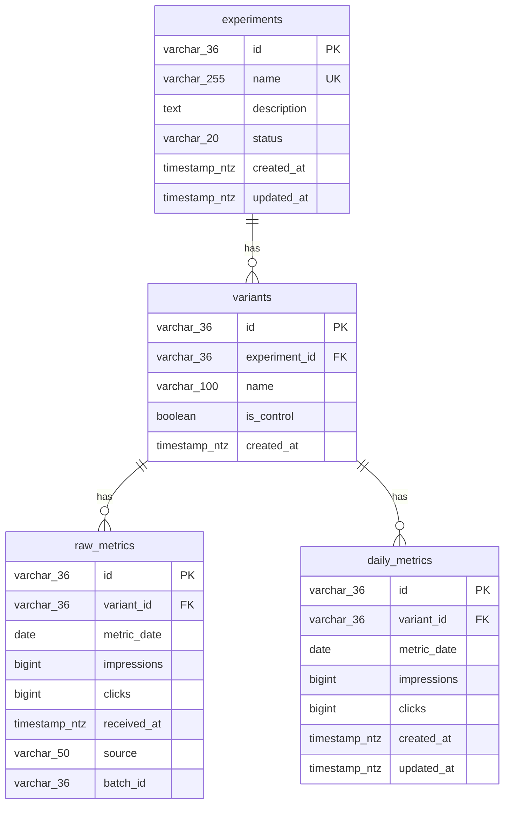

# Entity Relationship Diagram (ERD)

## Diagrama



---

## Relacionamentos

| De | Para | Cardinalidade | Descrição |
|----|------|---------------|-----------|
| experiments | variants | 1:N | Um experimento tem N variantes |
| variants | raw_metrics | 1:N | Uma variante tem N registros de métricas brutas |
| variants | daily_metrics | 1:N | Uma variante tem N registros de métricas diárias |

---

## Constraints

| Tabela | Constraint | Tipo | Colunas |
|--------|------------|------|---------|
| experiments | PK | PRIMARY KEY | id |
| experiments | uq_experiment_name | UNIQUE | name |
| variants | PK | PRIMARY KEY | id |
| variants | fk_variant_experiment | FOREIGN KEY | experiment_id → experiments.id |
| variants | uq_variant_name_per_experiment | UNIQUE | (experiment_id, name) |
| raw_metrics | PK | PRIMARY KEY | id |
| raw_metrics | fk_raw_metrics_variant | FOREIGN KEY | variant_id → variants.id |
| daily_metrics | PK | PRIMARY KEY | id |
| daily_metrics | fk_daily_metrics_variant | FOREIGN KEY | variant_id → variants.id |
| daily_metrics | uq_daily_metrics_variant_date | UNIQUE | (variant_id, metric_date) |

---

## Clustering Keys (Snowflake)

| Tabela | Clustering Key | Propósito |
|--------|----------------|-----------|
| raw_metrics | metric_date | Otimiza queries de auditoria por período |
| daily_metrics | (variant_id, metric_date) | Otimiza query do Thompson Sampling |

---

## Fluxo de Dados

```
┌─────────────────────────────────────────────────────────────────┐
│                        POST /experiments                         │
└─────────────────────────────┬───────────────────────────────────┘
                              │
                              ▼
                    ┌───────────────────┐
                    │    experiments    │
                    │                   │
                    │  id (PK)          │
                    │  name (UK)        │
                    │  description      │
                    │  status           │
                    │  created_at       │
                    │  updated_at       │
                    └─────────┬─────────┘
                              │ 1:N
                              ▼
                    ┌───────────────────┐
                    │     variants      │
                    │                   │
                    │  id (PK)          │
                    │  experiment_id(FK)│
                    │  name             │
                    │  is_control       │
                    │  created_at       │
                    └─────────┬─────────┘
                              │
              ┌───────────────┴───────────────┐
              │ 1:N                           │ 1:N
              ▼                               ▼
┌───────────────────────┐       ┌───────────────────────┐
│     raw_metrics       │       │    daily_metrics      │
│     (auditoria)       │       │     (cálculo)         │
│                       │       │                       │
│  id (PK)              │       │  id (PK)              │
│  variant_id (FK)      │       │  variant_id (FK)      │
│  metric_date          │       │  metric_date          │
│  impressions (BIGINT) │       │  impressions (BIGINT) │
│  clicks (BIGINT)      │       │  clicks (BIGINT)      │
│  received_at          │       │  created_at           │
│  source               │       │  updated_at           │
│  batch_id             │       │                       │
└───────────────────────┘       └───────────────────────┘
        │                                   │
        │ INSERT (append-only)              │ UPSERT (merge)
        │                                   │
        └───────────────┬───────────────────┘
                        │
                        ▼
              ┌───────────────────┐
              │ GET /allocation   │
              │                   │
              │ Thompson Sampling │
              │ (lê daily_metrics)│
              └───────────────────┘
```

---

## Propósito de Cada Tabela

| Tabela | Escrita | Leitura | Propósito |
|--------|---------|---------|-----------|
| **experiments** | POST /experiments | GET /allocation | Cadastro do experimento |
| **variants** | POST /experiments | GET /allocation | Cadastro das variantes |
| **raw_metrics** | POST /metrics | Auditoria/Debug | Backup append-only, rastreabilidade |
| **daily_metrics** | POST /metrics | GET /allocation | Dados limpos para cálculo do algoritmo |

---

## Colunas de Observabilidade (raw_metrics)

| Coluna | Valores | Propósito |
|--------|---------|-----------|
| `source` | 'api', 'gam', 'cdp', 'manual' | Identifica origem dos dados |
| `batch_id` | UUID ou identificador | Rastreia qual job/ingestão enviou os dados |

Útil para debug quando dados vierem duplicados ou incorretos.
