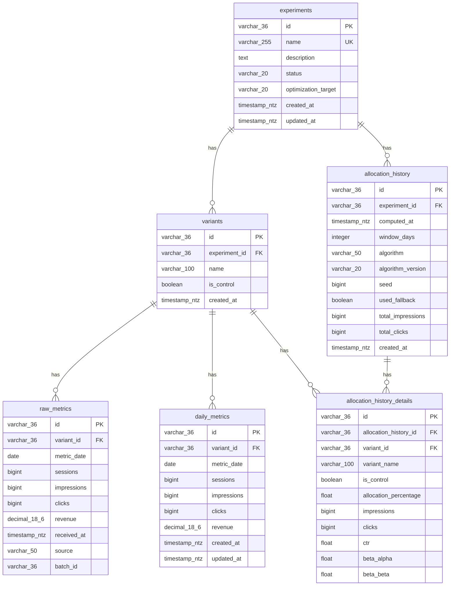

# Entity Relationship Diagram (ERD)

## Diagrama



---

## Relacionamentos

| De | Para | Cardinalidade | Descrição |
|----|------|---------------|-----------|
| experiments | variants | 1:N | Um experimento tem N variantes |
| experiments | allocation_history | 1:N | Um experimento tem N registros de alocação |
| variants | raw_metrics | 1:N | Uma variante tem N registros de métricas brutas |
| variants | daily_metrics | 1:N | Uma variante tem N registros de métricas diárias |
| allocation_history | allocation_history_details | 1:N | Uma alocação tem N detalhes (um por variante) |
| variants | allocation_history_details | 1:N | Uma variante aparece em N históricos de alocação |

---

## Constraints

| Tabela | Constraint | Tipo | Colunas |
|--------|------------|------|---------|
| experiments | PK | PRIMARY KEY | id |
| experiments | uq_experiment_name | UNIQUE | name |
| variants | PK | PRIMARY KEY | id |
| variants | fk_variant_experiment | FOREIGN KEY | experiment_id → experiments.id |
| variants | uq_variant_name_per_experiment | UNIQUE | (experiment_id, name) |
| raw_metrics | PK | PRIMARY KEY | id |
| raw_metrics | fk_raw_metrics_variant | FOREIGN KEY | variant_id → variants.id |
| daily_metrics | PK | PRIMARY KEY | id |
| daily_metrics | fk_daily_metrics_variant | FOREIGN KEY | variant_id → variants.id |
| daily_metrics | uq_daily_metrics_variant_date | UNIQUE | (variant_id, metric_date) |
| allocation_history | PK | PRIMARY KEY | id |
| allocation_history | fk_allocation_history_experiment | FOREIGN KEY | experiment_id → experiments.id |
| allocation_history_details | PK | PRIMARY KEY | id |
| allocation_history_details | fk_allocation_detail_history | FOREIGN KEY | allocation_history_id → allocation_history.id |
| allocation_history_details | fk_allocation_detail_variant | FOREIGN KEY | variant_id → variants.id |

---

## Clustering Keys (Snowflake)

| Tabela | Clustering Key | Propósito |
|--------|----------------|-----------|
| raw_metrics | metric_date | Otimiza queries de auditoria por período |
| daily_metrics | (variant_id, metric_date) | Otimiza query do Thompson Sampling |
| allocation_history | (experiment_id, computed_at) | Otimiza queries de auditoria por experimento/data |

---

## Fluxo de Dados

```
┌─────────────────────────────────────────────────────────────────┐
│                        POST /experiments                         │
└─────────────────────────────────┬───────────────────────────────┘
                              │
                              ▼
                    ┌───────────────────┐
                    │    experiments    │
                    │                   │
                    │  id (PK)          │
                    │  name (UK)        │
                    │  description      │
                    │  status           │
                    │  optimization_target
                    │  created_at       │
                    │  updated_at       │
                    └─────────┬─────────┘
                              │ 1:N
                              ▼
                    ┌───────────────────┐
                    │     variants      │
                    │                   │
                    │  id (PK)          │
                    │  experiment_id(FK)│
                    │  name             │
                    │  is_control       │
                    │  created_at       │
                    └─────────┬─────────┘
                              │
              ┌───────────────┴───────────────┐
              │ 1:N                           │ 1:N
              ▼                               ▼
┌───────────────────────┐       ┌───────────────────────┐
│     raw_metrics       │       │    daily_metrics      │
│     (auditoria)       │       │     (cálculo)         │
│                       │       │                       │
│  id (PK)              │       │  id (PK)              │
│  variant_id (FK)      │       │  variant_id (FK)      │
│  metric_date          │       │  metric_date          │
│  sessions             │       │  sessions             │
│  impressions (BIGINT) │       │  impressions (BIGINT) │
│  clicks (BIGINT)      │       │  clicks (BIGINT)      │
│  revenue              │       │  revenue              │
│  received_at          │       │  created_at           │
│  source               │       │  updated_at           │
│  batch_id             │       │                       │
└───────────────────────┘       └───────────────────────┘
        │                                   │
        │ INSERT (append-only)              │ UPSERT (merge)
        │                                   │
        └───────────────┬───────────────────┘
                        │
                        ▼
              ┌───────────────────┐
              │ GET /allocation   │
              │                   │
              │ Thompson Sampling │
              │                   │
              │ Otimiza:          │
              │ - CTR (clicks/imp)│
              │ - RPS (rev/sess)  │
              │ - RPM (rev/imp)   │
              └─────────┬─────────┘
                        │
                        │ Salva automaticamente
                        ▼
              ┌───────────────────┐
              │allocation_history │
              │                   │
              │  experiment_id    │
              │  computed_at      │
              │  algorithm        │
              │  algorithm_version│
              │  seed             │
              │  used_fallback    │
              └─────────┬─────────┘
                        │ 1:N
                        ▼
              ┌───────────────────┐
              │allocation_history │
              │    _details       │
              │                   │
              │  variant_id       │
              │  allocation_%     │
              │  impressions      │
              │  clicks           │
              │  beta_alpha       │
              │  beta_beta        │
              └───────────────────┘
```

---

## Propósito de Cada Tabela

| Tabela | Escrita | Leitura | Propósito |
|--------|---------|---------|-----------|
| **experiments** | POST /experiments | GET /allocation | Cadastro do experimento e target de otimização |
| **variants** | POST /experiments | GET /allocation | Cadastro das variantes |
| **raw_metrics** | POST /metrics | Auditoria/Debug | Backup append-only, rastreabilidade |
| **daily_metrics** | POST /metrics | GET /allocation | Dados limpos para cálculo do algoritmo |
| **allocation_history** | GET /allocation | SQL direto | Auditoria de decisões de alocação |
| **allocation_history_details** | GET /allocation | SQL direto | Detalhes por variante de cada decisão |

---

## Colunas de Observabilidade (raw_metrics)

| Coluna | Valores | Propósito |
|--------|---------|-----------|
| `source` | 'api', 'gam', 'cdp', 'manual' | Identifica origem dos dados |
| `batch_id` | UUID ou identificador | Rastreia qual job/ingestão enviou os dados |

---

## Colunas de Auditoria (allocation_history)

| Coluna | Propósito |
|--------|-----------|
| `seed` | Permite reproduzir exatamente o mesmo resultado |
| `algorithm_version` | Identifica qual versão do algoritmo foi usada |
| `used_fallback` | Indica se usou prior por falta de dados |
| `window_days` | Janela temporal usada no cálculo |

---

## Métricas e Targets de Otimização

| Coluna | Usado para calcular |
|--------|---------------------|
| `sessions` | RPS (Revenue Per Session) |
| `impressions` | CTR, RPM |
| `clicks` | CTR |
| `revenue` | RPS, RPM |

| Target | Fórmula | Quando usar |
|--------|---------|-------------|
| `ctr` | clicks / impressions | Maximizar engajamento |
| `rps` | revenue / sessions | Maximizar receita por usuário |
| `rpm` | (revenue / impressions) × 1000 | Maximizar receita por inventário |
