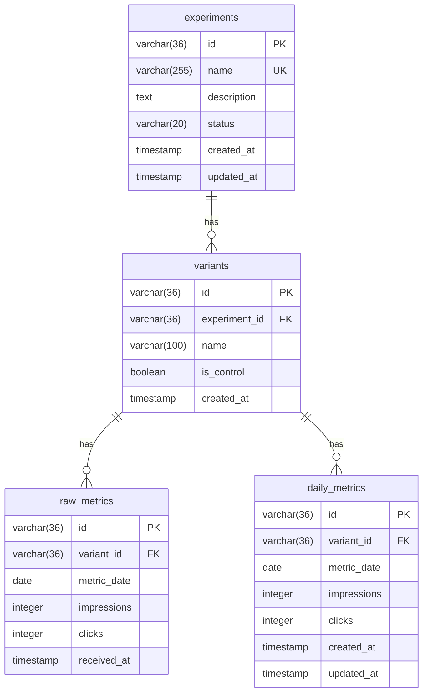

## Relacionamentos

| Relação | Cardinalidade | Descrição |
|---------|---------------|-----------|
| experiments → variants | 1:N | Um experimento tem N variantes |
| variants → raw_metrics | 1:N | Uma variante tem N registros de métricas brutas |
| variants → daily_metrics | 1:N | Uma variante tem N registros de métricas diárias |

## Constraints

| Tabela | Constraint | Tipo |
|--------|------------|------|
| experiments | name | UNIQUE |
| variants | (experiment_id, name) | UNIQUE |
| daily_metrics | (variant_id, metric_date) | UNIQUE |

## Propósito de cada tabela

| Tabela | Escrita | Leitura | Propósito |
|--------|---------|---------|-----------|
| experiments | POST /experiments | GET /allocation | Cadastro do experimento |
| variants | POST /experiments | GET /allocation | Cadastro das variantes |
| raw_metrics | POST /metrics | Auditoria | Backup, append-only |
| daily_metrics | POST /metrics | GET /allocation | Dados limpos para cálculo |
